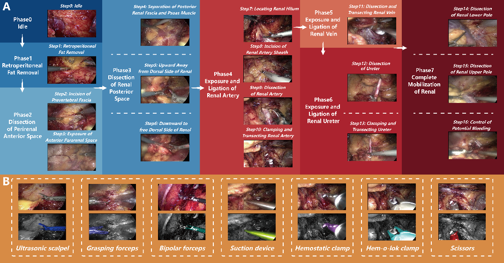
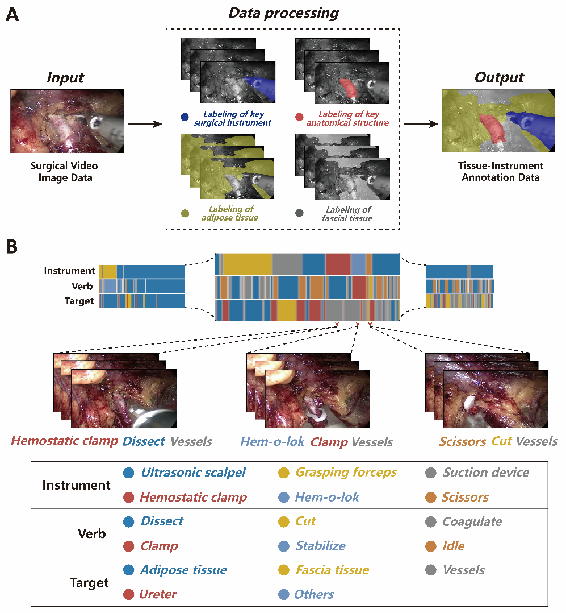
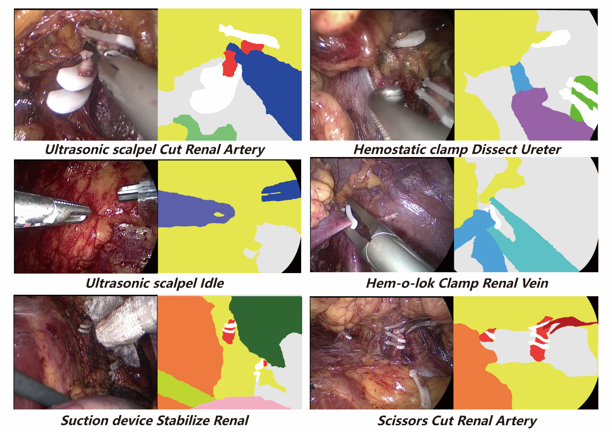

# Enhancing Surgical Scenes Understanding through Deep Learning: Mapping Full-Granularity Surgical Atlas in Laparoscopic Kidney Surgery Application
***Guangdi Chu, Yuan Gao, Wei Jiao, Guipeng Wang, Chengjun Li, Fengyuan Zhang, Pengfei Zhang, Xu Han, Zhiyuan Mi, Jingkai Wang, Xiaohui Ren, Jianning Wang, Shuxin Wang, Qian Dong, Haitao Niu, Jianmin Li***
## Abstract 
The comprehensive understanding of surgical scenes by computers is crucial for achieving intelligent surgery. However, the advancement and clinical application of artificial intelligence technology based on visual information in surgical research have been limited by the lack of high-quality annotated full-granularity datasets and efficient recognition strategies. In this study, we collected 41 laparoscopic kidney surgery videos and performed detailed annotations of surgical phases, steps, instruments, and surgical action triplets (SATs) based on strict criteria. Using deep learning algorithms, we achieved efficient and accurate multi-task recognition in one pass. The dataset formed in this study includes 141,443 frames of surgical phase and step annotations, 25,305 frames of SATs annotations, and 8,435 frames of surgical instrument annotations. Our framework achieves single-pass multi-task recognition with average accuracies of 90.51% and 84.47% for surgical phases and steps, respectively, while the average specificity for all SATs subtasks exceeds 80%. Compared to six excellent single-task algorithms, our method significantly improves computational efficiency and accuracy. The newly formed full-granularity dataset and surgical scene understanding framework provide new research data and effective exploration methods for the intelligence of surgical operations, and can be extended to more types of surgical procedures and more application scenarios such as robot-assisted surgery.
## Data Annotation
In this study, we performed both coarse and fine-grained task recognition for each video and expert surgeons discussed the details of annotations and selected the retroperitoneal approach. Based on previous reports and our own experiences, we summarized the detailed annotation process. For the coarse-grained task annotation, a team of three urologists independently performed frame-by-frame recognition and annotation of the surgical videos regarding their respective phases and steps. For fine-grained tasks, the annotations include instrument segmentation and SATs. For instrument segmentation, we selected a frequency of 16 frames per second, while for critical steps during the procedure (such as renal vessel handling), we performed more intensive extraction at a rate of 8 frames per second. And we selected two frames before and after the designated surgical instrument segmentation frame, creating a sequence of three frames for SATs annotation. This ensures that our segmentation and SATs are fully aligned, providing a rich and complete dataset for annotation. After selecting the segmentation frames and SATs annotation frames, a team of 20 annotators, trained in professional surgical knowledge, performed frame-by-frame delineation on the extracted video frames. Using Labelme software, comprehensive annotations were made for the segmentation frames. Different colors were used to delineate various surgical instruments, tissue types, and anatomical structures, ensuring there were no gaps between different structures to guarantee the quality of further computer recognition. During the annotation process of SATs, since SATs labeling requires temporal context, annotators could access all surgical recordings when necessary. After completing the annotation of SATs, a team of senior professional surgeons conducted a further review to minimize the impact of various human factors, such as annotation errors, instrument recognition mistakes, and omitted parts of the dataset, thereby eliminating delineation heterogeneity and ensuring high-quality data processing.
 
 
 
## Model Overview
### 1. Problem formulation
Given a video stream, we need to identify the surgical phase and surgical step of the current frame, as well as recognize the triadic interactions between the doctor and the patient in that frame. Additionally, it is necessary to parse the entire surgical scene at the pixel level. Therefore, this represents a multi-task problem that involves multiple image classifications and requires image segmentation. Furthermore, since multiple triplets may appear in each frame, this also constitutes a multi-label classification problem.

